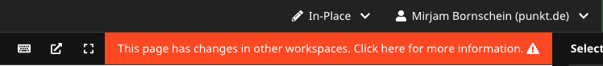
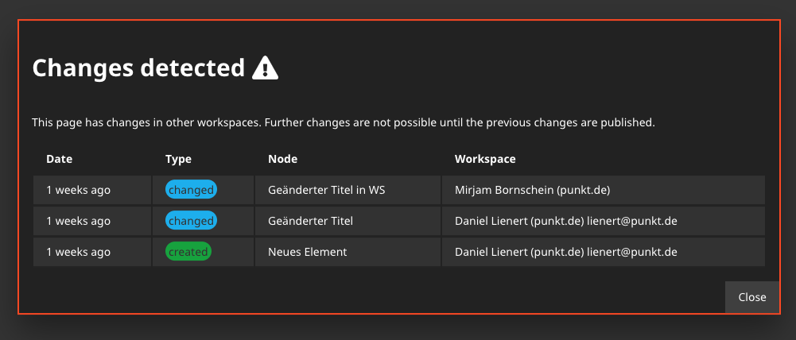

# PunktDe.EditConflictPrevention

[](https://travis-ci.com/punktDe/editconflictprevention) [](https://packagist.org/packages/punktDe/editconflictprevention) [](https://packagist.org/packages/punktDe/editconflictprevention) [](https://packagist.org/packages/punktDe/editconflictprevention)

This package helps preventing edit conflicts when several editors are working on content simultaneously. 

### Information about changes of the current document in other workspaces

When changes in other workspaces exist on the same document, a warning is displayed in the upper toolbar. 

	
Clicking that warning opens a modal, showing a list of changed nodes and where they have been changed. Contact information from Neos Party is displayed to make it easier to communicate.



### Prevent the editor to do conflicting changes

There are also privilege targets available which prevents editing a document and all containing content nodes when changes in other workspaces are detected. To prevent an editor from editing such pages, add the following privilege configuration to your `Policy.yaml` 

```yaml
roles:
	'Neos.Neos:AbstractEditor':
	privileges:
		-
		privilegeTarget: 'PunktDe.EditConflictPrevention.EditNodeWithChangesInOtherWorkspaces'
		permission: DENY
		-
		privilegeTarget: 'PunktDe.EditConflictPrevention.EditNodePropertiesWithChangesInOtherWorkspaces'
		permission: DENY
```

## Installation

```bash
composer require punktde/editconflictprevention  
```

## Configuration

`excludedDocumentTypes`: List the document types here, that you like to exclude from detecting conflicts.
