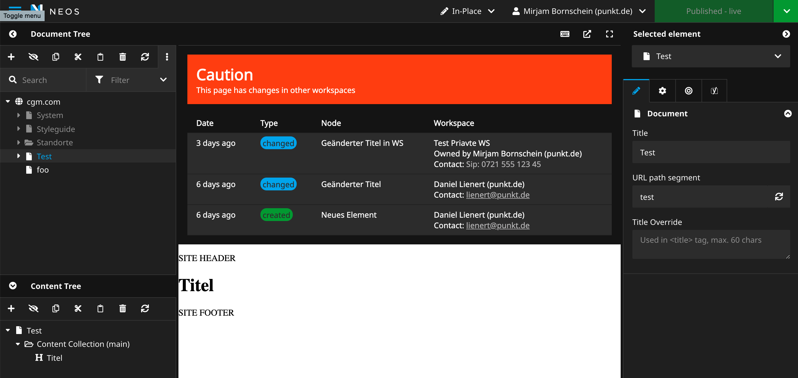

# PunktDe.EditConflictPrevention

  

This package helps preventing edit conflicts when several editors are working on content simultaneously. When changes in other workspaces exist on the same document, a warning is displayed, showing a list of changed nodes and where they have been changed. Contact information from Neos Party is displayed to make it easier to communicate.

There are also a privilege targets available which prevents editing a document and all containing content nodes when changes in other workspaces are detected.

## Installation

    $ composer require punktde/editconflictprevention  
